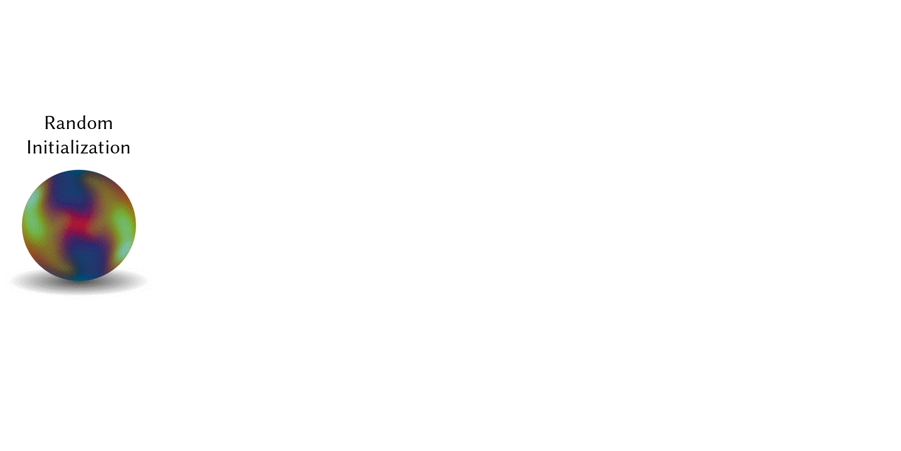

## Metappearance: Meta-Learning for Visual Appearance Reproduction

This is the offical code repository for our paper

**Metappearance: Meta-Learning for Visual Appearance Reproduction [SIGGRAPH Asia 2022, Journal Track]**

by [Michael Fischer](https://mfischer-ucl.github.io) and [Tobias Ritschel](https://www.homepages.ucl.ac.uk/~ucactri). 
For more information, make sure to check out the [paper](https://arxiv.org/abs/2204.08993) 
and [project page](https://mfischer-ucl.github.io/metappearance/).

<p align="center">
 
</p>

___
### Installation

Create a new conda environment, activate it and install the dependencies.  
```
cd metappearance 
conda create -n myenvname python=3.8 
conda activate myenvname
pip install torch==1.8.1+cu111 torchvision==0.9.1+cu111 torchaudio==0.8.1 -f https://download.pytorch.org/whl/torch_stable.html
pip install -r requirements.txt
python fix_metaconv.py
export PYTHONPATH=.
```

Tested with Python 3.8, PyTorch 1.8.1 and CUDA 11.1 on Ubuntu 20.04.4 x64 and an NVIDIA RTX3000 series GPU.   
___
### Usage 

First, change the `basepath` in `config/main.yaml` to where you saved this repository. 

#### Data 
To use this codebase, you will then need to download the respective data. 
* For texture, you can use any (stationary) texture found on the internet. We included some examples.
* For BRDF, we used the [MERL](https://www.merl.com/brdf/) database.
* For svBRDF, we used the flash images from [Henzler2021](https://github.com/henzler/neuralmaterial).

Create a train- and test-split and move the files to the respective subfolder, e.g., `data/brdf/<train/test>`. 
More info on the datasets can be found in the supplemental of the paper. 

#### Mode
We provide three modes for now: texture, BRDF and svBRDF. Select which mode to use in `config/main.yaml` or, when 
running via the cmd line, as hydra argument: `general.mode='<mode>'`. Hydra
will then load the corresponding subdict automatically. Mode-specific parameters can be set in the 
respective `<mode>.yaml`. To use your own mode, see "Extensions" below.  

We provide a pre-trained checkpoint for each mode. They are located under `checkpts`. Each checkpoint is expected to 
at least provide two keys; the initialization and the per-parameter learning rate (`model_state_dict, param_lr`). 


#### Training 
To train with the provided modes, run `meta_train.py` with the respective mode set in `main.yaml` or as arg, e.g.
```
python src/meta_train.py general.mode='texture'
```
Hydra will log the current experiment config, tensorboard-output and checkpoints in `hydra_logs/Metappearance/<mode>`.


#### Inference 
To run inference, run `meta_inference.py` with the respective mode set in `main.yaml` or as arg, e.g.

```
python src/meta_inference.py general.mode='texture'
```

If `save_converged` is true, the final model parameters per-task will be saved in 
`hydra_logs/Metappearance/<mode>/converged`. For BRDF, this will create `<name>.npy` files that comply with the 
[NBRDF](http://www0.cs.ucl.ac.uk/staff/A.Sztrajman/webpage/publications/nbrdf2021/nbrdf.html) format and can be rendered with Mitsuba. 
If `save_output` is true, the final model output (e.g., a synthesized texture) per-task will be saved in `hydra_logs/Metappearance/<mode>/output`.

#### Extensions
Metappearance can easily be extended to use other models and data, as all application logic is provided by the 
abstract baseclass `Metappearance` in `metappearance.py`. All you need to do is implement subclasses of 
`MetaDataset`, `MetaTask`, `MetaModel` and potentially your own loss function (or use one of the provided ones). Create a new 
config file `mymode.yaml` with your hyperparameters, extend `resolve_data`, `resolve_model` and `resolve_loss` to point to your subclasses,
and you're good to go!  

`MetaModel` should make use of `torchmeta`, e.g.: 
```python
import torch 
from models.metamodel import MetaModel
from torchmeta.modules import MetaModule, MetaConv2d

class MyMetaModel(MetaModule, MetaModel): 
    def __init__(self):
        super(MyMetaModel, self).__init__()
        
        self.conv = MetaConv2d(3, 3, 3)

    def forward(self, x, params=None): 
        return self.conv(x, params=params.get_subdict('conv'))
```
In general, torchmeta expects a weight dictionary `params` during the forward pass. This will be used during the forward passes of the innerloop
instead of the model's own weights. To get started with torchmeta, cf. their 
[github](https://github.com/tristandeleu/pytorch-meta) or this 
[blog](https://medium.com/pytorch/torchmeta-a-meta-learning-library-for-pytorch-f76c2b07ca6d) post. 

A `MetaDataset` should provide the ability to sample `MetaTasks`, e.g.: 
```python
from datasets.metadataset import MetaDataset, MetaTask

class MyMetaDataset(MetaDataset): 
    def __init__(self):
        super(MyMetaDataset, self).__init__()
        
        self.tasks = []
        self.create_tasks()     # init tasks 
    
    def create_tasks(self):
        self.tasks.append(MetaTask(...))    # create MetaTasks by, e.g., reading images
    
    def sample_task(self, idx=None):
        if idx is None: idx = np.random.randint(0, len(self.tasks))
        return self.tasks[idx]
```

And finally, a `MetaTask` should provide train- and test-batched tuples of `(data, gt)` via the function `sample()`: 
```python
from datasets.metadataset import MetaTask
class MyMetaTask(MetaTask): 
    def __init__(self):
        super(MyMetaTask, self).__init__()
    
    def sample(self, mode='train'):
        return self.get_trainbatch() if mode == 'train' else self.get_testbatch() 

    def get_trainbatch(self):
        return self.train_data, self.gt

    def get_testbatch(self):
        return self.test_data, self.gt
```
___
### License 
This code is licensed under the MIT license. 
___
### Citation

If you find our work useful or plan to (re-) use parts of it in your own projects, please include the following citation: 

```
@article{fischer2022metappearance,
  title={Metappearance: Meta-Learning for Visual Appearance Reproduction},
  author={Fischer, Michael and Ritschel, Tobias},
  journal={ACM Trans Graph (Proc. SIGGRAPH Asia)},
  year={2022},
  volume={41},
  number={4}
}
```
